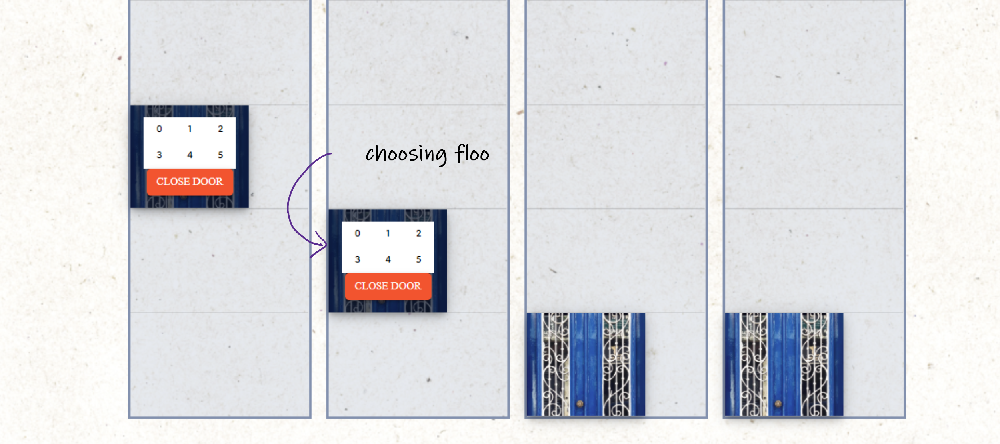

# :book: Table of Content:

- [About The Project](#project-description)
- [Approach](#aproach)
- [Project Structure](#project-structure)
- [Technologies](#technologies)
- [Getting Started](#getting-started)
- [Landing page](#landing-page)
- [Screenshots](#screenshots)
- [Adding an elevator](#scenario1)
- [Pick up request](#sc)
-

## :pencil: About The Project

The aim of this project is to simulate elevator system mechanizm. The system can simultenuasly process ay least 16 elevators. It allows to:

- Process pick up request
- Update elevator's state
- Simulate the lifting step
- Choose a desired floor
- Check the current state of the elevator: direction, floor and destination

## :rocket: Approach

## :file_folder: Project Structure

```bash
│   App.js
│   index.js
│   reportWebVitals.js
│
├───assets
│       background-system.png
│       door.png
│
├───components
│   ├───Controller
│   │       Controller.js
│   │       styles.js
│   │
│   ├───Elevator
│   │       Elevator.js
│   │       styles.js
│   │
│   ├───ElevatorSystem
│   │       ElevatorSystem.js
│   │       styles.js
│   │
│   ├───Floor
│   │   │   Floor.js
│   │   │   styles.js
│   │   │
│   │   └───Door
│   │           Door.js
│   │           styles.js
│   │
│   └───Header
│       │   Header.js
│       │   styles.js
│       │
│       └───AddButton
│               AddButton.js
│               styles.js
│
├───constants
│       enums.js
│
├───hooks
│       useDoorWorker.js
│       useElevatorWorker.js
│       useWebworker.js
│
└───themes
        light.js
```

## :computer: Technologies

- JavaScript, multithreading(web workers)
- React.js, hooks
- Material UI

## :pushpin: Getting Started

First of all download the project. Then in the project directory use the following command to start the application:

```bash
  npm start
```

The app will be in the development mode.\
Open [http://localhost:3000](http://localhost:3000) to view it in the browser.

## Screenshots

### Landing page


### Adding an elevator


### Pick up


### Choosing the floor



### Status display


### Adding an elevator
