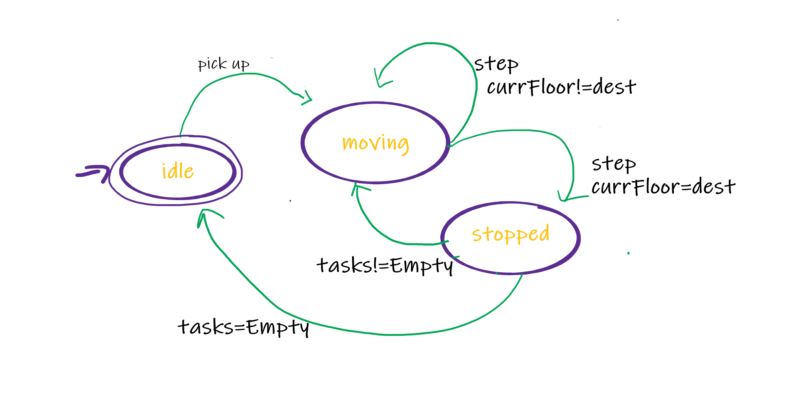

# :book: Table of Content:

- [About The Project](#project-description)
- [Goals and Scenarios](#goals)
- [Approach](#aproach)
- [Project Structure](#project-structure)
- [Technologies](#technologies)
- [Getting Started](#getting-started)
- [Landing page](#landing-page)
- [Screenshots](#screenshots)

## :pencil: About The Project

The aim of this project is to simulate elevator system mechanism. The system can simultaneously serve at least 16 lifts. It allows to:

- Process pick up requests
- Update elevator's state
- Simulate the lifting step
- Choose a desired floor
- Check the current state of the elevator: direction, floor and destination

## :rocket: Goals and Scenarios

The basic elevator system includes an elevator, logic controls and special buttons for sending requests. On every floor there are two buttons: "UP" and "DOWN" that represents the desired direction. The elevator responds to the pressing of these buttons depending on the current travel route. If it is idle, it will respond immediately to the floor of the user request. Moreover, the elevator always moves from bottom to top and only stops in response to requests that are on it's current path. When all requests are handled in one cycle direction, the elevator will reverse and begin serving other pending tasks. The user can choose the destination floor presssing dedicated buttons inside the lift.

#### Some basic Scenarios

- When a user presses UP or DOWN, the elevator will begin moving towards the source of request provided it matches it's current route, otherwise the requests will be added to the pending queue
- When the elevator is idle, it responds immediately to requests
- When there are several users inside the elevator with different disered locations the elevator will firstly served the one that is along it's path
- If the user refuses to select the a floor, the elevator will automatically close after 5 seconds and begin serving other requests

## :telescope: Approach

In order to implement an elevator system I used a SCAN algorithm. It is a simple algorithm used in disk scheduling.

#### The main idea of algorithm

1. Let our elevator system store three queue of tasks.`tasks` array represents currently handled requests that are on the route path. The `up` array represents up requests that can not be served at the moment, the same with `down` array but in the opposite direction. The values are unique and sorted in ascending order.
2. If a user presses the "UP"/"DOWN" button the `pickUp(direction,source)` is trigged. Then a task is added to a dedicated queue depending on its direction and the source of request.
3. If the current direction of the elevator is "UP" and `tasks` is not empty it shifs and serves the first request from the queue. If the direction is "DOWN" - pops and serves the last request from the queue.
4. If `tasks` is empty, the elevator will check pending requests in `up` or `down` queue and then update `tasks`. If queues are empty the elevator changes its state to "IDLE".

When implementing the SCAN algorithm, I considered the elevator system as a finite state machine. The image bellow represents the basic concept. As you can see the main states are: "IDLE", "MOVING", "STOPPED". Under certain actions and conditions, the elevator changes its state. I used Redux to store and manage the condition of the 16 elevators. I have defined some actions such as: "STEP", "PICK_UP", "CLOSE_DOOR", "ADD_TASKS", "SET_IDLE", "ADD_PENDING" which return a new state.
An algorithm that helps to select the appropriate elevator defined in the function `checkAvailable(elevators, direction, destination)`, which is called on "PICK_UP". It tries to select the closest along the path and in the same direction. If the elevators are busy, it will select the closest one, but return an object informing to add the task to pending queue (up / down).



## :file_folder: Project Structure

```bash
│   App.js
│   index.js
│   reportWebVitals.js
│
├───assets
│       background-system.png
│       door.png
│
├───components
│   ├───Controller
│   │       Controller.js
│   │       styles.js
│   │
│   ├───Elevator
│   │       Elevator.js
│   │       styles.js
│   │
│   ├───ElevatorSystem
│   │       ElevatorSystem.js
│   │       styles.js
│   │
│   ├───Floor
│   │   │   Floor.js
│   │   │   styles.js
│   │   │
│   │   └───Door
│   │           Door.js
│   │           styles.js
│   │
│   ├───Header
│   │   │   Header.js
│   │   │   styles.js
│   │   │
│   │   └───AddButton
│   │           AddButton.js
│   │           styles.js
│   │
│   └───PickUpPanelControl
│           PickUpButton.js
│           PickUpPanelControl.js
│           styles.js
│
├───constants
│       enums.js
│
├───hooks
│       useElevatorWorker.js - not used
│       useWebworker.js - not used
│
├───middleware
│       scheduler.js
│
├───store
│       elevator-actions.js
│       elevator-reducer.js
│       mock-elevators.js
│       mock-floors.js
│       reducers.js
│
└───themes
        light.js
```

## :computer: Technologies

- JavaScript
- Redux
- React.js, hooks
- Material UI

## :pushpin: Getting Started

First of all download the project. Then in the project directory use the following command to start the application:

```bash
  npm start
```

The app will be in the development mode.\
Open [http://localhost:3000](http://localhost:3000) to view it in the browser.

## Screenshots

### Landing page & example view


### Adding an elevator


### Pick up


### Choosing the floor


### Status display


## Links

- Demo URL: [https://brave-edison-d2dcad.netlify.app/](https://brave-edison-d2dcad.netlify.app/)
